**Do not be afraid to breathe deeply**

Why has mankind still not been able to defeat the flu virus? One cardinal way would be to not inhale the virus, but no one wants to walk in a gas mask. Perhaps humanity could forget about airborne infections, if a brilliant designer could introduce a fashion for a mask or a helmet-filter, maybe featuring a "hoop with a veil" design, during an epidemic. So, we are waiting for a brilliant designer. Sometimes, when viruses become very contagious or deadly, the situation spurs mask developers to create something that could really radically solve the problem. But, when the virus season ends, this desire passes unrealized. This is understandable, because of the complexity of the task, both in terms of engineering, designing and commerce. Commercial challenges arise because the device must be very cheap in order to be accessible for the entire population of the Earth, including the poorest. Storing a filter mask in a warehouse between epidemics would already drive the price unacceptably high. The way out of the situation could be to design a device so simple that its mass production could be deployed in a short time after the outbreak. Engineering difficulties lie in the necessity to ensure sufficient efficiency of virus absorption by a stand-alone device that does not have expensive and difficult to use removable components.

An absolutely necessary condition for the mask to function is to ensure moderate excess pressure of  (virus-free) air under the mask. That is,  a fan or a compressor should be part of an individual means of protection against the virus.

There is a good idea for the filter that needs to be checked: an electrostatic filter on charged particles of fine aerosol of ordinary water. It does not require consumables (except for distilled water), is fantastically cheap to manufacture and there is a high probability that our filter mask will be much more effective than other masks. It can be produced both in mass production and on an individual 3D printer. We (more about us at the end of the article) offer this idea for joint development using a virtual team to speed up the work. All you need to participate in the development is access to a 3D printer / desire to understand physical processes / the ability to find beautiful engineering solutions / experience in organizing large-scale production. An open source development is conducted on Github ([https://github.com/FilterCOVID-19/FilterCOVID-19_ENG)), alongside with a complete description of the principles embodied in the filter and downloadable models for manufacturing on a 3D printer. Having made any of the variants of such a device and having tested it, you can safely attend any events, meetings with a large number of people, without being to get infected or to infect someone else. For the safety of others we strongly recommend that an output filter of a similar design is installed. The low cost of the filter and the lack of consumables allow this. 

The concept is based on three main ideas.. Firstly, in order to protect yourself from the virus, you do not need any vaccinations, neither from the flu virus, nor from the common cold, nor from any other infection. It is enough to utilize massively effective personal protective equipment. Second, the solution to a pandemic can be an independent printout of individual filters on a 3D printer without leaving your home. Third, for mass production, the cost and complexity of the filter and helmet should be minimal.

The filter consists of a small number of parts: a housing, a battery, an electric motor, a disk for generating fine water mist, dielectric inserts on which the disk is mounted, mesh-electrodes for collecting drops, a high-voltage collector from the disk, a plastic insert to create a "cyclone", as well as, optionally, a charcoal or silica gel filter.

The principle of operation of the filter is based on two physical principles: 1) charging the virus-particle in order to then precipitate it with a charge of the opposite sign; 2) merging of the virus-containing droplets due to surface tension and precipitation of large particles. We assume that this can be done by purifying the air with a large number of electrically charged fine particles with a large collective surface.

**Individual air purification device**

Water is dispensed through a capillary to the inner (cone) side of the disk that rotates at high speed. The droplet that has fallen into the center of the cup, due to centrifugal force, moves along a slightly conical surface, while breaking into small drops and charging due to friction on the surface of the disk. The resulting charged fine particles are carried away with the air stream generated by a small impeller on the reverse side of the disk, which creates a turbulent flow at high speeds of rotation. Air with fine particles passes through a spiral section of the casing in which the virus particles are recharged, absorbed by water droplets and the water droplets enlarge. Fine water droplets are positively charged due to the triboelectric effect, while the surface of the disk is getting negatively charged. The charge on the disk is used in the droplet collection unit with a mesh electrode. In addition, the inlet of the droplet collection unit and the grid electrode are designed in such a way that the droplets are collected by centrifugal force, as in the cyclone air separator. Thus, two mechanisms of absorption of a biological aerosol containing a virus are provided: mechanical (due to the merging of water droplets due to their surface tension, and their subsequent collection using a "cyclone" system) and electrostatic (due to the targeted attraction between the neutral virus-containing and charged particles, recharging of a viral particles due to fusion with a charged drop of water and their collection on a high-voltage particle-collecting electrode).

Of course, this is just an idea that needs refinement and verification.

We invite everyone to the virtual team, or, if you have such an opportunity, to carry out one of the parts of these works yourself. In connection with current events, everyone may need such a filter. The speed of successful creation of such a device will determine the number of lives saved by it. The production of such filters is not technically difficult; many production capacities can be converted for its production.

Practical Filter Design

All blocks are made in the style of a non-spill inkwell.

*The principle of a non-spill inkwell*

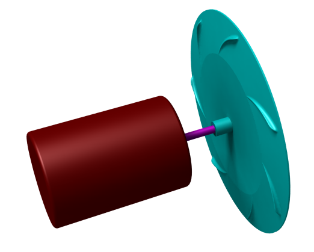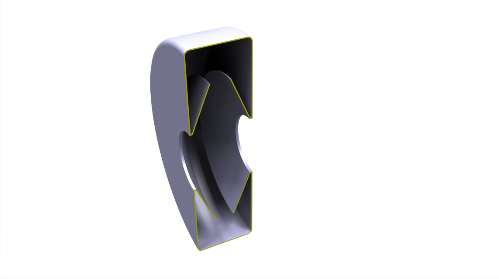 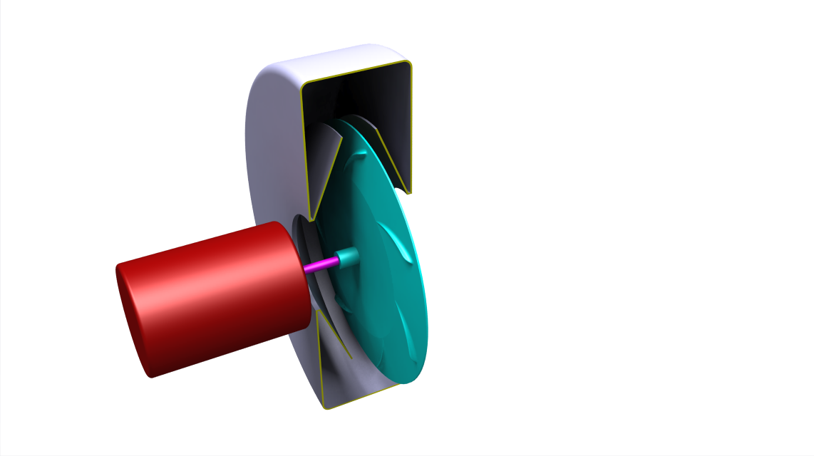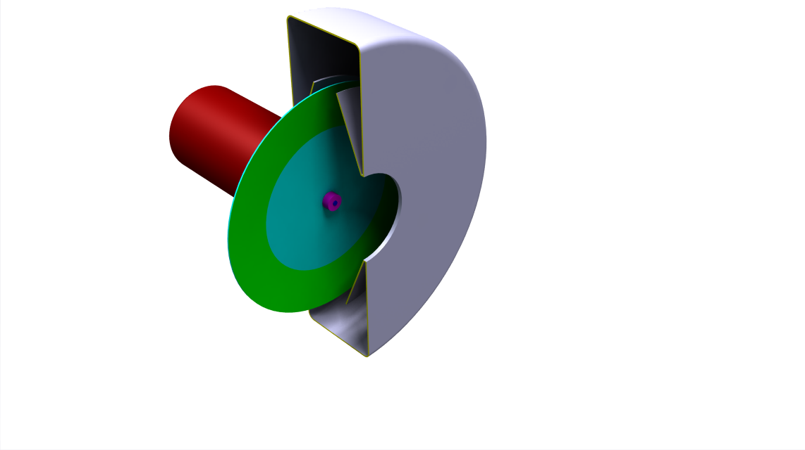

*A motor with a disc and a non-spill chamber forming a droplet spraying unit*

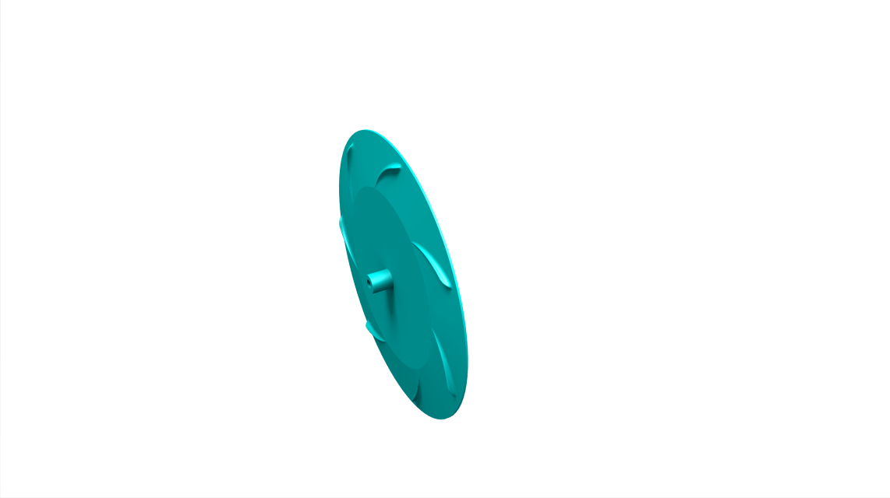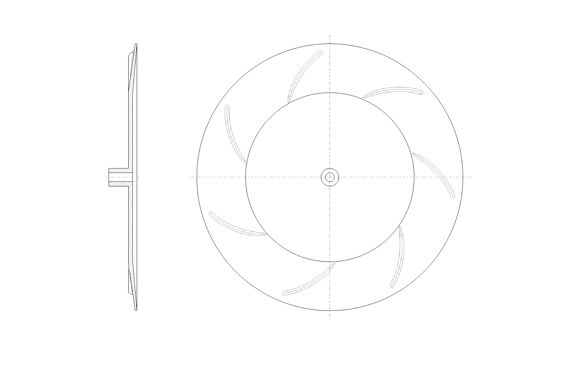

*Mist-generating disk*

The disk has radial blades forming a directed air flow. The inner surface of the disk has a conical section with notches for the formation of micron drops of water under the action of centrifugal force. Under the influence of the triboelectric effect, these drops acquire a positive charge.

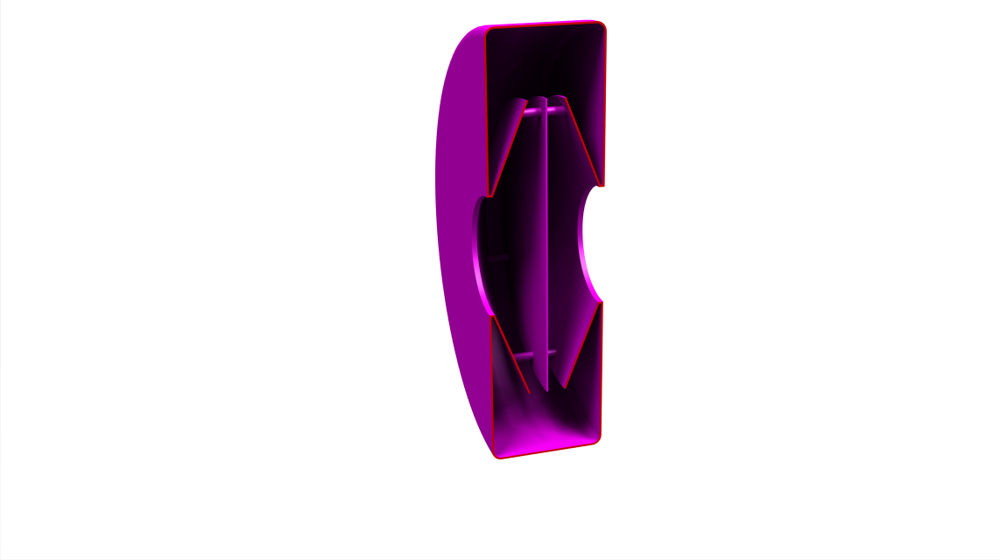

*The block for mixing of the suspended droplets with air*

The chamber is divided by a partition forming a turbulent flow when air passes through it. The main task is to enable the droplets to draw dangerous viruses onto their surface.

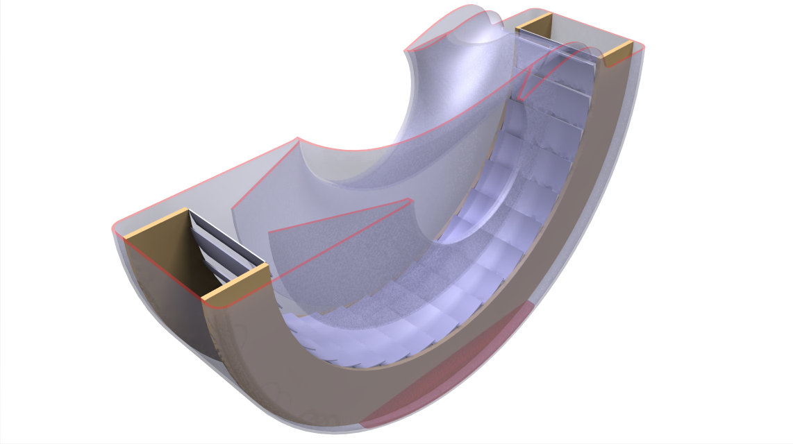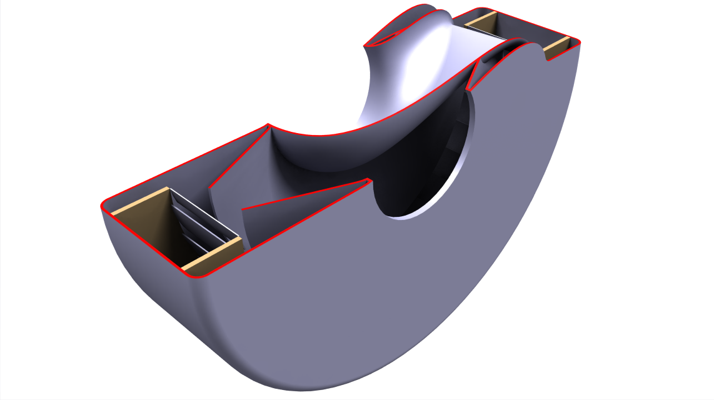

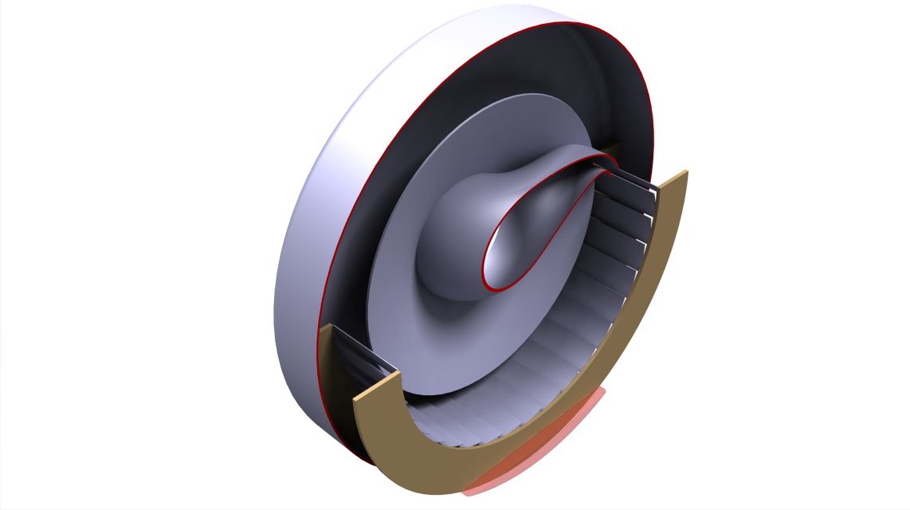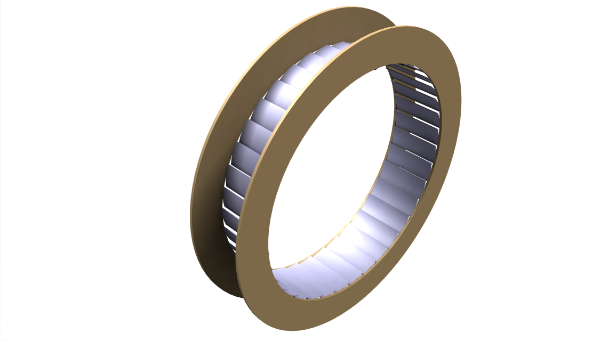

*Moisture settling unit*

This block contains a guide nozzle which generates a vortex flow in the chamber. The camera is arranged on the principle of a "cyclone" filter. In the “non-spill” zone there is a metal grate that provides electrostatic precipitation of the virus-containing charged droplets. The non-spill mixing and mist-setting chambers are connected in the water compartment and contain a disinfectant dispenser and a valve for draining waste water. Purified air enters the central outlet.

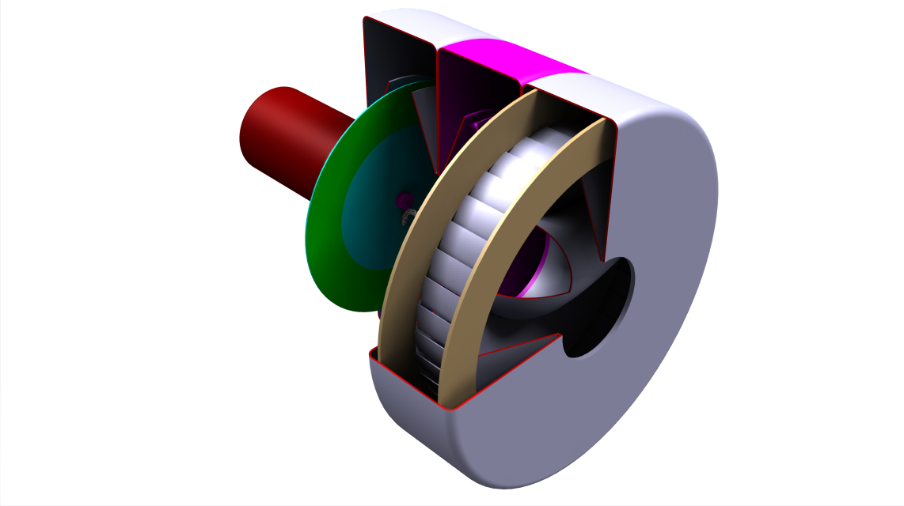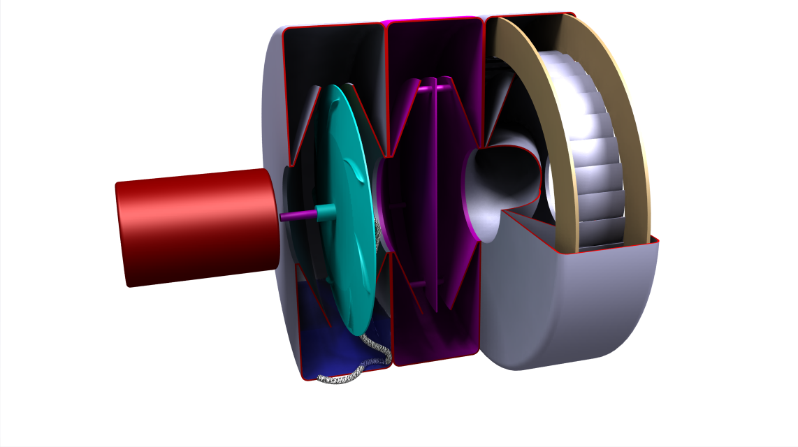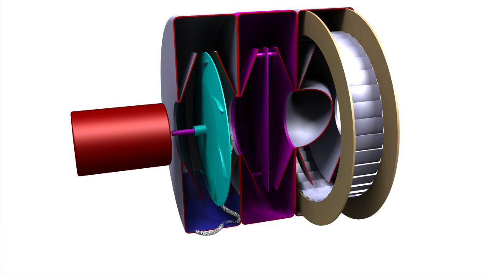

*General view of the device assembly*

At the final stage of purification, the air passes through silica gel, which absorbs excess moisture. Silica gel plays the role of an indicator of the effective operation of the "cyclone" and electrostatic precipitator. The appearance of liquid in it indicates a filter malfunction (air filtration functions without the help of silica gel, it is simply a guarantee of safety in the event of a device breakdown).

**Suggestions as to the helmet design**

The design solution of the filter is a necklace fixed on the collar of any garment using magnetic latches, that is, one magnet is located inside the necklace, and the second under the clothes or collar. If the design of the case is made in the form of a necklace ring with some flexibility, and an annular groove is created along the upper edge of this necklace, in which the film could be clamped with a clamp, then the helmet could be made of any flat film in the form of "origami" fixed on the body and sealed with an elastic opening for the neck. Inside the necklace there is a filter for the inlet and outlet air flows from the helmet, and a battery for powering the electric motor. A lack of charge in the battery or a malfunction of the electric motor is indicated visually by a decrease in the tension of the thin-film helmet and the cessation of the damper when inhaling and signals that the helmet must be removed. A damper exists so that the helmet does not inflate and deflate with each breath. The damper, compensating for the inhalation, is made in a separate chamber in the form of an inflating rubber ball in the tube connecting the helmet with the atmosphere. This is a mandatory element for all helmets, because it works like an emergency valve, when due to the cessation of air blowing (for example, during a malfunction or battery discharge) the pressure in the helmet drops - the ball deflates and depresses the helmet.

The air flow rate of the filter is determined by the human consumption of approximately 10 liters of fresh air per minute, multiplied by a redundancy coefficient of 2. Total, if we take the battery life of 12 hours, it translates to 1440 liters of air. The pressure created by the fan must ensure this flow rate, taking into account the passage through the openings of the small cross-section of the cyclone filter, the resistance of the chamber with the silica gel, and also the resistance of the helmet. The fluid flow rate and the volume that must be kept in the spray chamber is determined by the size of the sprayed particles (we focus on 1 μm) and the volume of air pumped through the filter. The specific surface area is equal to the product of the shape coefficient k and the reciprocal of the diameter of the droplet. For a micron spherical drop, 1 cubic meter of water is sprayed into water particles with 6x106 square meters of total surface.

The diameter of the necklace beads is determined by the minimum diameter of our disk in the case (approximately 5 cm). A rough test of this device can be carried out: 1) for the presence of high voltage using a school or homemade (from two strips of tissue paper) electrometer. 2) on the ability to absorb fine particles with cigarette smoke (when the filter is in operation, the smoke supplied to the inlet must be completely absorbed and not give a trace of smell in the outlet).

You can check the operation of the "cyclone" by disabling the electric deposition unit and checking for the presence of water in the silica gel. The device emits a faint white noise when generating mist, which is an indicator of normal operation.

**About us**

Unfortunately, our five-man team has limited capabilities. I, Veronica, wrote this article and am ready to answer your questions. The author of the conceptual ideas is my father (Igor). If you have questions, ask as soon as possible. He lies paralyzed and has very little time left. Yuri specializes in 3D modeling. Valeriy is ready to contact all interested parties for the manufacture of the filter and the organization of mass production. We will conduct all our work on GitHub (https://github.com/FilterCOVID-19/FilterCOVID-19_ENG). Please join.

Security guarantees: the user does everything at his own risk. The license is free.

